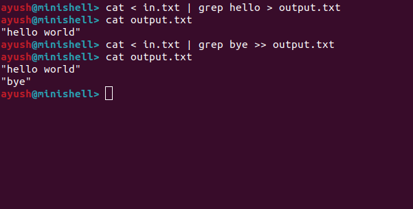

# MiniShell

A Unix-like command-line shell written in C++ as a systems programming project. 

The project demonstrates how a shell executes programs using Unix process management and inter-process communication primitives such as `fork()`, `execvp()`, `pipe()`, `dup2()`, and `wait()`.

The shell supports command execution, pipelines, and file redirection through a custom parser and execution engine.

---

## Features

- Execute external commands
- Built-in `cd`
- Built-in `exit`
- Input redirection (`<`)
- Output redirection (`>`)
- Append redirection (`>>`)
- Single and multi-stage pipelines
- Combined pipelines and redirection 
- Basic syntax error detection
- File error handling using `perror()`

---

## Examples

Execute a command 

```sh
ls -l
```

Input redirection

```sh
cat < input.txt
```

Output redirection

```sh
ls > output.txt
```

Append output

```sh
echo hello >> output.txt
```

Pipeline

```sh
ls | grep cpp | wc -l
```

Pipeline with redirection

```sh
cat < input.txt | grep hello > output.txt
```

---

## Building

Compile using the provided Makefile.

```sh
make
```

Run the shell

```sh
./minishell
```

Clean build files

```sh
make clean
```

---

## Project Structure

```
include/
	executor.h
	parser.h
	tokenizer.h

src/
	executor.cpp
	parser.cpp
	tokenizer.cpp
	main.cpp

Makefile
README.md
```

## Screenshot



## Limitations

Current version does not implement:

- Quoted strings
- Environment variable expansion
- Wildcard expansion (`*.cpp`)
- Background jobs (`&`)
- Command history
- Tab completion
- Logical operators (`&&`, `||`)
- Command substitution
- Job control (`fg`, `bg`, `jobs`)

---

## Future Work 

Shell V2 aims to include:

- Quoted string handling
- Environment variables
- Command history
- Tab completion
- Signal handling
- Background process execution
- Job control
- Improved parser architecture

---

## Concepts Used 

- C++
- Linux system programming 
- Process creation (`fork`)
- Program execution (`execvp`)
- Pipes (`pipe`)
- File descriptor manipulation (`dup2`)
- File I/O (`open`)
- Process synchronization (`wait`)
- Command parsing and execution

---

## License

This project is intended for learning and educational purposes
