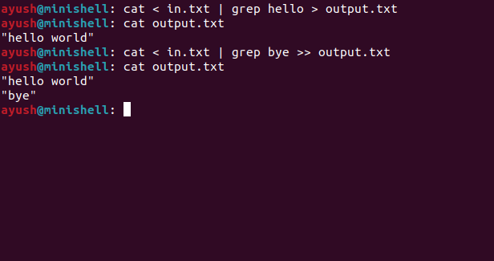
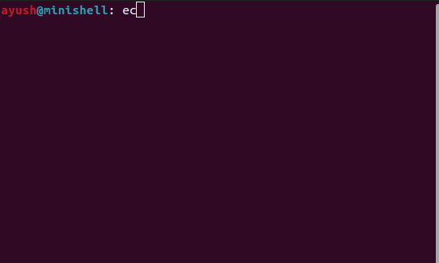
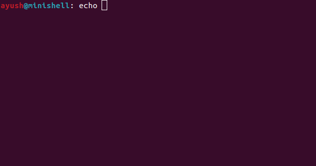
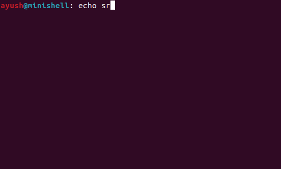
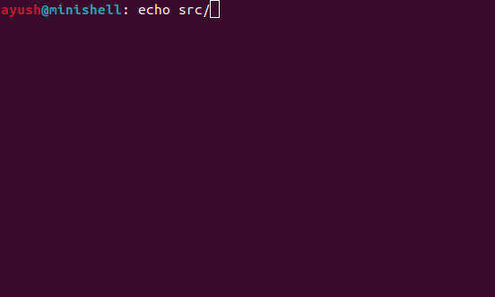
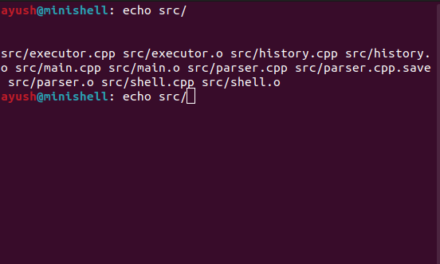

# MiniShell v2

A Unix-like command-line shell written in C++17 as a systems programming project.

This shell demonstrates Unix process management and inter-process communication using `fork()`, `execvp()`, `pipe()`, `dup2()`, and `wait()`. It includes a custom parser with variable expansion, wildcard matching, quote handling, and an interactive terminal with history and tab completion.

## Features

- **Command execution** - external programs via `fork()`/`execvp()`
- **Built-ins** - `cd`, `pwd`, `exit`
- **Pipelines** - single and multi-stage (`ls | grep cpp | wc -l`)
- **Redirections** - input (`<`), output (`>`), append (`>>`)
- **Quoted strings** - single quotes (`'...'`) and double quotes (`"..."`) with escape sequences
- **Variable expansion** - `$HOME`, `$PWD`, `$?`, `$$`, and arbitrary environment variables
- **Wildcard expansion** - `*`, `?`, and `~` via POSIX `glob()`
- **Command history** - navigate previous commands with ↑ and ↓ arrow keys
- **Line editing** - move cursor with ← and → arrows, insert/delete anywhere
- **Tab completion** - complete commands (first word), files, and paths; double-tap Tab to list matches
- **Syntax error detection** and file error handling via `perror()`

## Examples

### Execute a command
```bash
ls -l
```
---
### Input redirection
```bash
cat < input.txt
```
---

### Output redirection
```bash
ls > output.txt
```
---
### Append output
```bash
echo hello >> output.txt
```
---
### Pipeline
```bash
ls | grep cpp | wc -l
```
---
### Pipeline with redirection
```bash
cat < input.txt | grep hello > output.txt
```
---
### Quoted strings
```bash
echo "hello world"
echo 'this does not $expand'
echo "path is $HOME"
echo  "price is \$5"
```
---
### Variable expansion
```bash
echo $HOME
echo $$
false
echo $?     #prints 1
cd /tmp
echo $PWD   #prints /tmp
```
---

### Wildcards
```bash
echo src/*.cpp
ls include/*.h
```
---
### Tab completion
```bash
ec<TAB>     # completes to "echo "
cd sr<TAB>  # completes to "cd src/" (directories get trailing /)
ls mi<TAB><TAB>     # lists all matches
nano src/ex<TAB>    #completes to nano src/executor"
```
---

## Building

Compile using the provided Makefile:
```bash
make
```
Run the shell:
```bash
./minishell
```
clean build files:
```bash
make clean
```

## Project Structure
```text
minishell/
│  
├── src/
│   ├── executor.cpp
│   ├── history.cpp
│   ├── main.cpp
│   ├── parser.cpp
│   └── shell.cpp
│  
├── include/
│   ├── executor.h
│   ├── history.h
│   ├── parser.h
│   └── shell_state.h
│  
├── Makefile
└── README.md
```

## Screenshot











## Limitations

Current version does not implement:

- **Background jobs** (`&)`
- **Signal handling** (`Ctrl+c`, `Ctrl+D`)
- **Logical operators** (`&&`, `||`)
- **Command substitution** (`$(...)`)
- **Job control** (`fg`, `bg`, `jobs`)
- **History persistence across sessions**

## Future work

- Background process execution
- Signal handling (`SIGINT`, `SIGCHLD`)
- Job control
- History saved to `~/.minishell_history`
- Aliases
- Customizable prompt (`PS1`)

## Design overview

### High-level Flow

```text
User input -> History/Raw Mode -> Tokenize -> Expand variables -> Expand wildcards -> Execute
```

### Components

- **Terminal Input** (`history.cpp`) - Reads keystrokes in raw mode. Handles arrow keys (↑↓←→), backspace, tab completion, and line editing. Returns a complete string on Enter.

- **Tokenizer** (`parser.cpp`) - Splits raw input into Token objects. Tracks quote state (`'...'` vs `"..."`) and handles escape sequences (`\"`, `\'`, `\$`).

- **Variable Expander** (`parser.cpp`) - Substitutes `$VAR`, `$?`, `$$`, and environment variables. Skips tokens marked as single-quoted.

- **Wildcard Expander** (`parser.cpp`) - Uses POSIX `glob()` to expand `*`, `?`, and `~` patterns. One token can become many tokens.

- **Executor** (`executor.cpp`) - Dispatches builtins (`cd`, `pwd`) in the parent process. Forks and execvps external commands. Handles pipes and redirections.

- **Shell State** (`shell_state.h`) - Global `last_exit_status` shared between parser and executor for `$?` expansion.

### Key Design Decisions

#### Raw Mode RAII

`struct RawMode` in `history.cpp` saves terminal settings on construction and restores them on destruction. This guarantees the terminal isn't left in a broken state even if the shell crashes.

#### Builtins Run in Parent

`cd` and `pwd` execute without `fork()` because they must mutate the shell's own process state (working directory). External commands always fork.

#### Three-Pass Expansion

The parser processes tokens in strict order: tokenization -> variable expansion -> wildcard expansion. This ensures `$HOME/*.cpp` resolves correctly: first `$HOME` becomes `/home/you`, then `glob()` expands the path.

#### Tab Completion Context

Completion switches between command mode (searches `$PATH` + builtins) and file mode (searches current or specified directory) based on whether the cursor follows a pipe or sits at the start of the line.


## Concepts Used

- C++17
- Linux system programming
- Process creation (fork)
- Program execution (execvp)
- Pipes (pipe)
- File descriptor manipulation (dup2)
- File I/O (open)
- Process synchronization (wait)
- terminal raw mode (termios)
- Command parsing, tokenization, and expansion
- POSIX glob() for wildcard matching


## License

This project is intended for learning and educational purposes.
